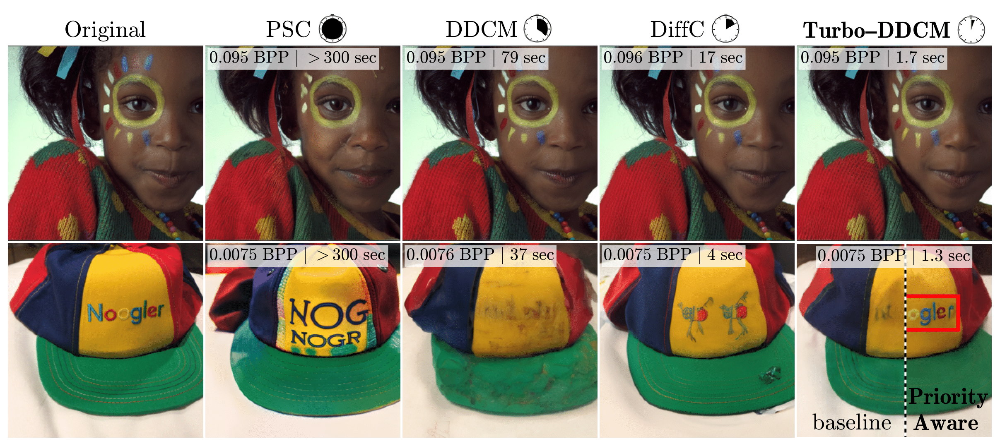

[](https://www.python.org/downloads/release/python-3810/)
[](https://pytorch.org/)
[](https://pytorch.org/)
[](https://github.com/huggingface/diffusers/)

# Turbo-DDCM: Fast and Flexible Zero-shot Diffusion-based Image Compression
<!-- omit in toc -->

<p>
  Amit Vaisman<sup>1</sup>, Guy Ohayon<sup>2</sup>, Hila Manor<sup>1</sup>,
  Tomer Michaeli<sup>1</sup>, Michael Elad<sup>1</sup> <br/>

  <sup>1</sup> Technion – Israel Institute of Technology     <sup>2</sup> Flatiron Institute, Simons Foundation
</p>

<!-- omit in toc -->
### [Project page]() | [Paper]() | [Demo (coming soon)]()

<!-- omit in toc -->


## Requirements

Install dependencies using:

```bash
conda create -n turbo_ddcm python=3.10
conda activate turbo_ddcm
python -m pip install -r requirements.txt
```
## Change Log

- **--**: Initial release.

## Usage Example

Our code supports compressing images of size $512^{2}$ (using Stable-Diffusion 2.1-Base) and $768^{2}$ (using Stable-Diffusion 2.1).
Run compression / decompression / roundtrip (compression-decompression):

```bash
python compress.py|decompress.py|roundtrip.py [FLAGS]
```
See the `--help` flag for the complete options and details.

### Main Compression Flags
- `--input_dir`: directory containing images to compress.
- `--output_dir`: directory to save the results.
- `--M`: atoms to be chosen from the codebook in each diffusion step ($M$ in our paper).

The compression script saves binary files and a config JSON (which is parsed during decompression), and it can optionally save reconstructions and compression runtimes.

compression example:
```bash
python compress.py --input_dir ./test_imgs --output_dir ./compress --M 30 --save_runtimes
```

### Main Decompression Flags
- `--input_dir`: directory containing compressed files.
- `--output_dir`: directory to save the results.

decompression example:
```bash
python decompress.py --input_dir ./compress --output_dir ./decompress --save_runtimes
```

The decompression script outputs reconstructions and, optionally, decompression runtimes. When compression runtimes are present in the input folder, it combines them to calculate the roundtrip runtime.

### Main Roundtrip Flags
- `--input_dir`: directory containing images to compress.
- `--output_compression_dir`: directory to save compression results.
- `--output_decompression_dir`: directory to save decompression results.
- `--M`: atoms to be chosen from the codebook in each diffusion step ($M$ in our paper).

roundtrip example:
```bash
python roundtrip.py --input_dir ./test_imgs --output_compression_dir ./compress --M 30 --output_decompression_dir ./decompress --save_runtimes
```

### Priority-Aware Compression

For priority-aware compression, use the `--weights_dir` flag in compress.py.
This flag should point to a directory containing one tensor file per image (each with the same name as the corresponding image and a .pt suffix).

Each tensor must have the same spatial dimensions as its corresponding image (e.g., a [512, 512] tensor for a [512×512] image) and should represent the pixel-wise prioritization map.

It is recommended to initialize the tensor with ones and then assign higher values to pixels that should be given higher priority during compression.

## Citation

If you use this code for your research, please cite our paper:

## Acknowledgements
This project is released under the [MIT license]()
We borrowed codes from [huggingface](https://github.com/huggingface) and [DDCM](https://github.com/DDCM-2025/ddcm-compressed-image-generation).


